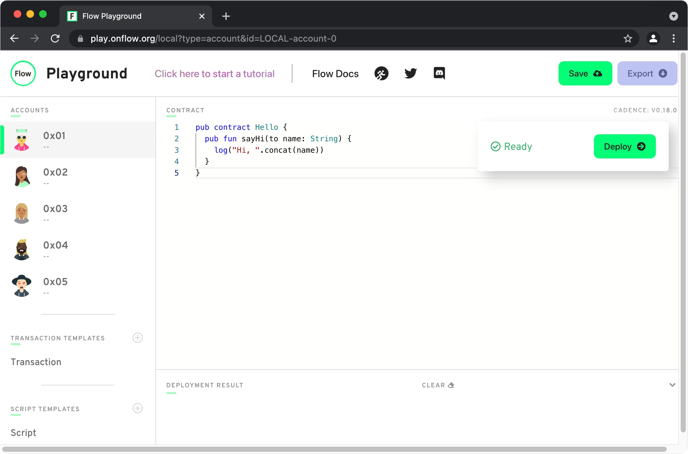
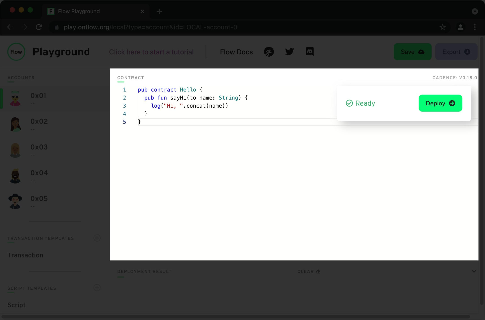
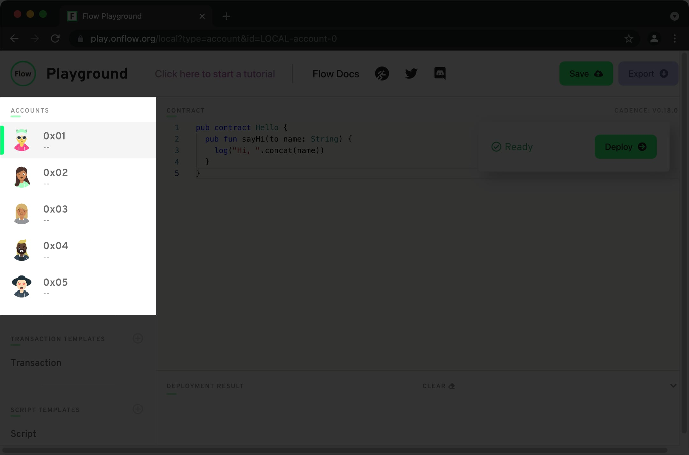
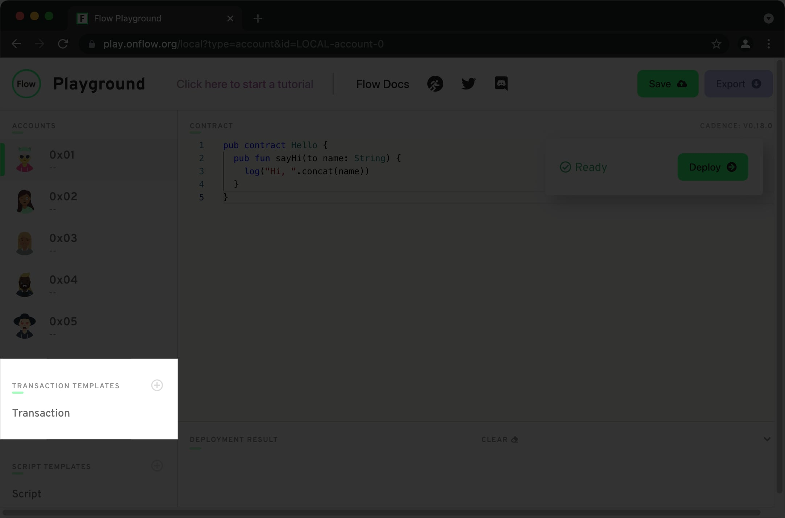
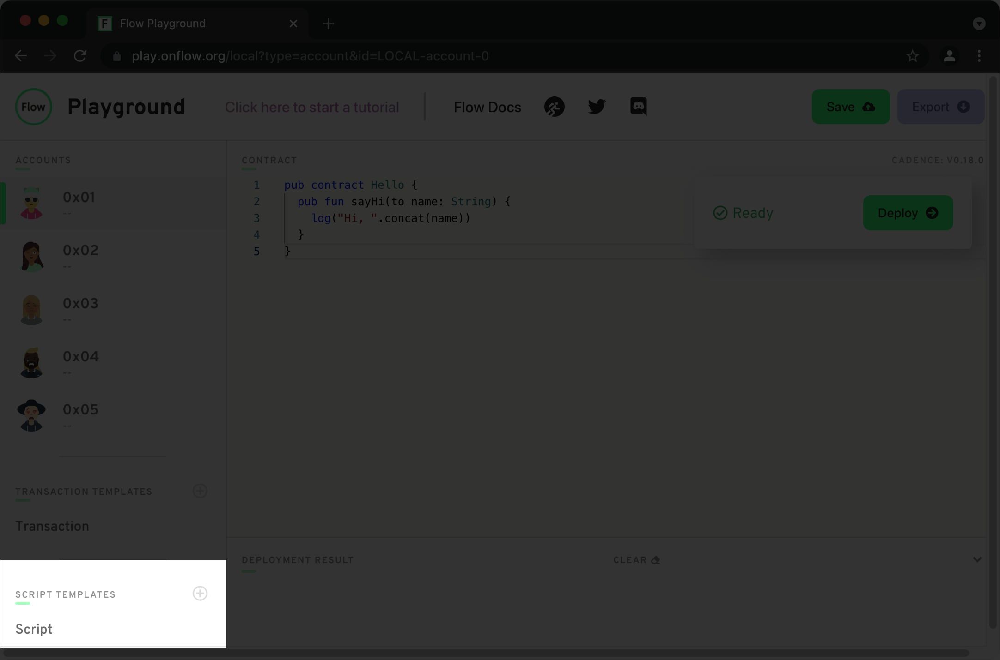
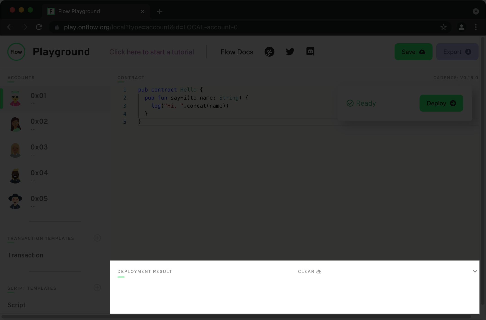

# Fast Floward | Week 1 | Day 2

Welcome back! I hope day 1 was fun and interesting. Today we'll get to learn about another Flow developer tool – **Playground**. Also, we'll write our first *smart contract* and get to send interact with it using *transactions* and *scripts*. Should be exciting! But first, let's review what we learned during day 1.

# Day 1 Review

- Flow is a cool blockchain.
- Cadence is the programming language for writing DApps on Flow.
- We can use `flow cadence` as a REPL shell, and `flow cadence file.cdc` to execute scripts.
- Cadence is strictly typed, and we explored the following built-in types.
  - `Int`
  - `Fix64`
  - `Address`
  - `String`
  - `Array`
  - `Dictionary`
- Cadence optionals, for example `let optional: String?`, are used when values can be `nil`.
- Cadence functions are value types with named labels.
- Cadence has two composite types:
  - `struct`: value type (copied),
  - `resource`: linear type (moved, can only exist once).
- Cadence `resource`'s use `<-` notation for movement, special keywords `create` and `destroy`, and `@` to denote resource type, for example `let canvas: @Canvas`.

# Playground

We executed our first lines of Cadence code using `flow cadence`. It's a great way to get started, when all we need is a programming language interpreter. However, decentralized applications are more than just interpreted code, they also interact with a global state which is the blockchain.

Flow provides us with a number of options to get started.

- A public testnet
- A self-contained local Flow emulator
- Playground

Today, we're going to use **Playground**, but we'll tackle the other two later this week.

## Environment

Fire up your browseer and open up [play.onflow.org][1] to launch Playground.

There are 5 key sections of the Flow Playground interface, let's take a look at each one.

## Cadence Editor

This is where you'll store your Cadence code. Because Playground emulates the Flow blockchain, there are special limitions that don't exist in the Cadence REPL shell.

- You can only define `contract`, `struct`, and `resource` types when in the **contract** editor, which you open by selecting any **account** from the left pane.
- Same goes for Cadence `event`'s.

Once you're ready to deploy a contract, hit that big green **Deploy** button. The button to re-deploy a contract will take its place.

Flow Playground allows you to update existing contracts, however, it's known that sometimes updates can fail and if you encounter a problem that shouldn't be there, try opening up a new Playground and deploying your contract there.

## Accounts

In Flow, everything is stored with accounts, including smart contracts. So to do anything, you'll need access to one or more accounts, thankfully Flow Playground provides us with 5 auto-generated accounts. This is a huge time saver.

One Playground limitation is that each account can only have one contract deployed.

## Transactions

This is where you define Flow transactions. Transactions are generally used to mutate the state of the blockchain, and as such need to be signed by every party that's involved. As with every blockchain, Flow transactions have to be signed cryptographically using a private key to encode transaction data. Thankfully, Playground abstracts this and signing transactions is a one-click effort.

## Scripts

The **Scripts** pane is where you define Flow scripts, which are read-only programs that don't require any blockchain mutations. As such, they don't incur a gas fee, unlike transactions (even though Playground doesn't have any fees), and they don't require authorization from any account.

## Log and Storage

Cadence provides an awesome quality-of-life feature for developers – `log()`. You can log variables, see how state changes as your program is executed, we already got to experience this with `flow cadence`. Playground is the only other place that let's you see your `log()` outputs.

In the bottom pane you'll also find account storage information, once you start storing data with accounts.

[1]: https://play.onflow.org/